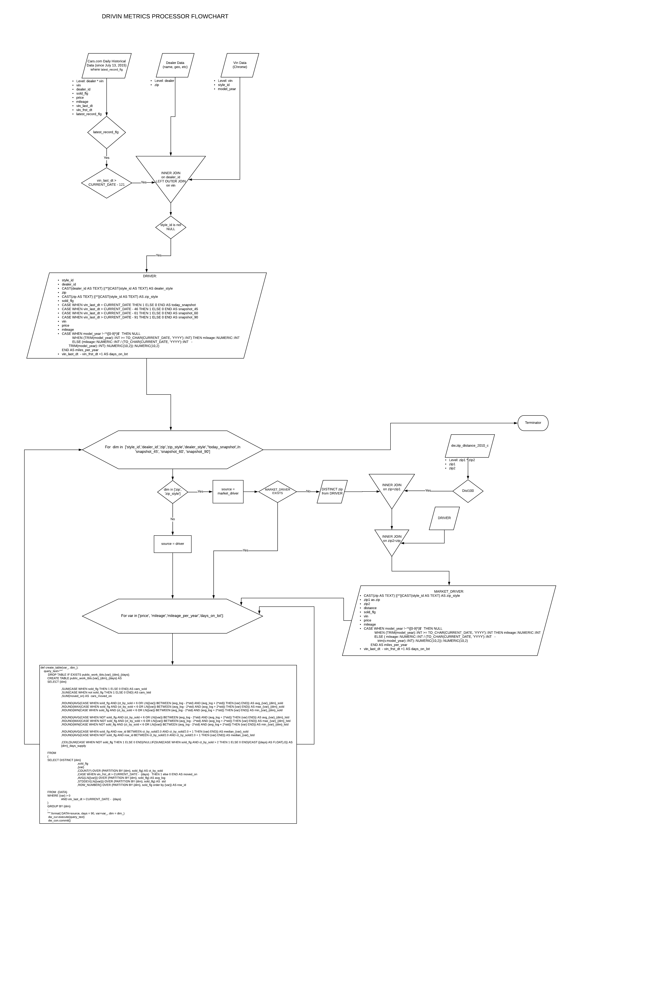

Metric Processor Development 
============================

## Purpose:
To create fact tables as part of the daily ETL process. This will enable all teams using cars.com or metrics data to use the same metrics vs. replicating these metrics each day as part of different scripts. This will enable us to standardize these metrics accross teams and products like TradeRev. 

## Frequency:
These metrics should be calculated daily and uploded to table/bucket that will hold current days metrics with all dimensions. 

## List of metrics:

* Days on Lot	
	* max\_sold
	* max\_lstd
	* min\_sold
	* min\_lstd
	* avg\_sold
	* avg\_lstd
	* median\_sold
	* median\_lstd
* Price	
	* max\_sold
	* max\_lstd
	* min\_sold
	* min\_lstd
	* avg\_sold
	* avg\_lstd
	* median\_sold
	* median\_lstd
* Cars	
	* cars\_sold (move_off)
	* cars\_aquired (moved_on)
	* cars\_lstd
	* days\_supply
* Mileage	
	* max\_sold
	* max\_lstd
	* min\_sold
	* min\_lstd
	* avg\_sold
	* avg\_lstd
	* median\_sold
	* median\_lstd
* Mileage	per year
	* max\_sold
	* max\_lstd
	* min\_sold
	* min\_lstd
	* avg\_sold
	* avg\_lstd
	* median\_sold
	* median\_lstd

## List of dimensions:

* Primary Dimensions:
	* National level (style\_id) 	
	* Dealer level (dealer\_id)
	* Market level (zip) or lat/long distance from dealer 
		* 25, 50, 100, 250 and nationwide	
	* Zip/Market + style\_id
	* Dealer + style\_id
	* Market + style\_id

* Secondary Dimensions:
	* Current day snapshot
	* 45-day snapshot
	* 60-day snapshot
	* 90-day snapshot

## Inputs:

- dw.dealer\_vin\_price\_sale\_hist\_c   
- ods.chrome\_\_vin\_c  
- dw.dealer_c
- dw.zip\_distance\_2010\_c

## Approach:

> The process is borrowing from Adesa metrics processor logic, with dealer ID and zip sourced from dealer table, vin chrome/style ID - from chrome vin table, market inventory definition - from 2010 zip distance data, and metrics (price, mileage, mileage per year, days on a lot) - from price history table.  
> 
> Upon evaluation of 13 different methods of outlier detection (including median and MAD (symmetrical and assymetrical, with and without normality assumption, with and without special handling of cases with more than 50% identical values), the empirical rule (with and without logarithmic transformation with 2 and 3 standard deviation options), Chebyshev's Theorem, and percentiles, the Empirical Rule with logarithmic transformation and 2 standard deviations was selected for production as the one producing the minimal mean absolute error among all 13 methods. This is also consistent with <a href="https://publish.manheim.com/content/dam/consulting/Used-Vehicle-Summary-Methodology.pdf" title="Title">
Manheim Used Vehicle Value Index methodology</a>.

> Below is a flowchart illustrating suggested production process:

> 

This is <a href="https://github.com/sweetride/drivin-metrics-processor/blob/master/MPMetricsCalcFlow.png" title="Title">
a link to png file</a>.

## Code:

https://github.com/sweetride/drivin-metrics-processor/blob/master/bin/metrics_processor.py

## Outputs:

> 24 tables (3 vars * 8 dims) with the following naming convention:
> 
_prod\_works\_tbl.{var}\_{dim}\_90_  
where:   
_var_ = ['price', 'mileage', 'mileage\_per\_year', 'days\_on\_lot']  
_dim_ = ['style\_id', 'dealer\_id', 'zip', 'zip\_style', 'dealer\_style', 'today\_snapshot', 'snapshot\_45', 'snapshot\_60', 'snapshot\_90']

> Sample of a table schema: 
> 
> _dim_ = 'dealer\_style'  
> _var_ = 'price'  
> prod\_works\_tbl.price\_dealer\_style\_90 

| dealer\_style  | cars\_sold | cars\_lstd | cars\_moved\_on | avg\_price\_sold | avg\_price\_lstd | min\_price\_sold | min\_price\_lstd | max\_price\_sold | max\_price\_lstd | median\_price\_sold | median\_price\_lstd | dealer\_style\_days\_supply |
|----------------|-----------:|-----------:|----------------:|-----------------:|-----------------:|-----------------:|-----------------:|-----------------:|-----------------:|--------------------:|--------------------:|----------------------------:|
| 7000013*386493 |          8 |          6 | 12              |            24313 |            23719 |            23498 |            22925 |            24994 |            24837 |               24130 |               23591 |                          68 |
| 7000013*367528 |         12 |          3 | 7               |            19473 |            20883 |            16998 |            19973 |            21486 |            21699 |               20275 |               20978 |                          23 |
| 7000013*367882 |          3 |          2 | 3               |            21025 |            21848 |            18997 |            21551 |            23548 |            22144 |               20994 |               21848 |                          36 |
| ...            |        ... |        ... |   ...              |              ... |              ... |              ... |              ... |              ... |              ... |                 ... |                 ... |                         ... |

> Can be combined into one table. Not 100% sure about efficiencies gained/lost. Meaning that combination of calendar\_date, dealer\_id and style\_id would the the primary key and all other metrics and combinations of dimensions as columns for example cars\_sold\_25\_mile\_market\_today and cars\_sold\_25\_mile\_market\_45_day

## Future Improvements
> Add a dimension of Lat/Long-driven distance buckets + style\_id

